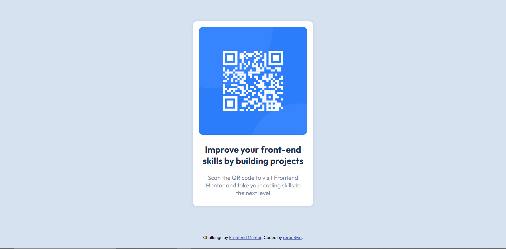

# Frontend Mentor - QR code component solution

This is a solution to the [QR code component challenge on Frontend Mentor](https://www.frontendmentor.io/challenges/qr-code-component-iux_sIO_H). Frontend Mentor challenges help you improve your coding skills by building realistic projects.

## Table of contents

- [Screenshot](#screenshot)
- [My process](#my-process)
  - [Built with](#built-with)
  - [What I learned](#what-i-learned)
  - [Continued development](#continued-development)
  - [Useful resources](#useful-resources)
- [Author](#author)
- [Acknowledgments](#acknowledgments)

### Screenshot

## My process

For this project, I began by structuring the HTML using semantic tags, incorporating 
 elements to organize the layout effectively. Utilizing CSS custom properties, I defined variables for colors to maintain consistency and facilitate easy theming throughout the component. Additionally, I enhanced the visual appeal of the project by importing the "Outfit" font from Google Fonts to add a unique typographic touch.

Throughout the styling process, I adhered to a modular approach, leveraging measurements such as multiples of 8 pixels and percentages divisible by 8 for precise and harmonious design. To ensure responsiveness across various devices, I referred to resources such as W3Schools for guidance on implementing media queries effectively.

### Built with

- Semantic HTML5 markup
- CSS custom properties

### What I learned

In this project, I learned how to structure HTML for a QR code component and style it using CSS. Here are some key takeaways:

Semantic HTML5 markup is essential for accessibility and SEO.
Using CSS custom properties (variables) allows for easier theme management and consistent styling across components.

### Continued development

In future projects, I want to focus on the following areas:

- Exploring advanced CSS techniques for layout and design.
- Learning JavaScript to add interactivity and functionality to my projects.

### Useful resources

- MDN Web Docs - (https://developer.mozilla.org/en-US/) - A comprehensive resource for HTML, CSS, and JavaScript documentation.
- W3Schools - (https://www.w3schools.com/css/css_rwd_mediaqueries.asp) - Another comprehensive resource i used for learning media queries using css.
- The Markdown Guide- (https://www.markdownguide.org/) - A helpful resource for learning Markdown syntax.

## Author

- Frontend Mentor - [@ruran8wa](https://www.frontendmentor.io/profile/ruran8wa)

## Acknowledgments

I'd like to thank Frontend Mentor for providing this challenge and the supportive community for feedback and inspiration.
